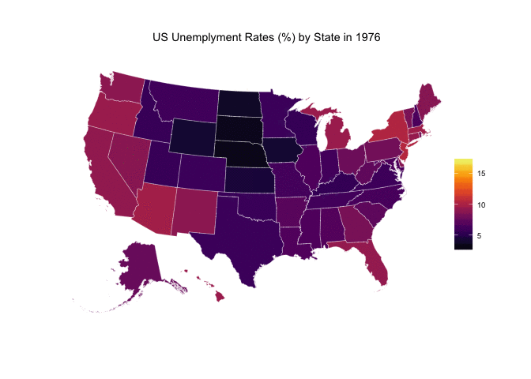
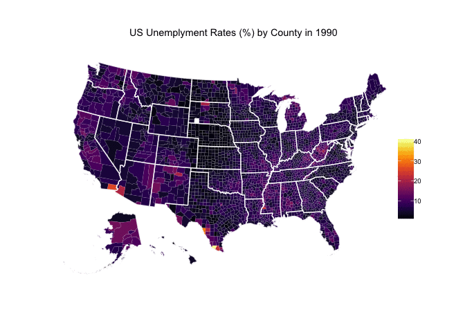
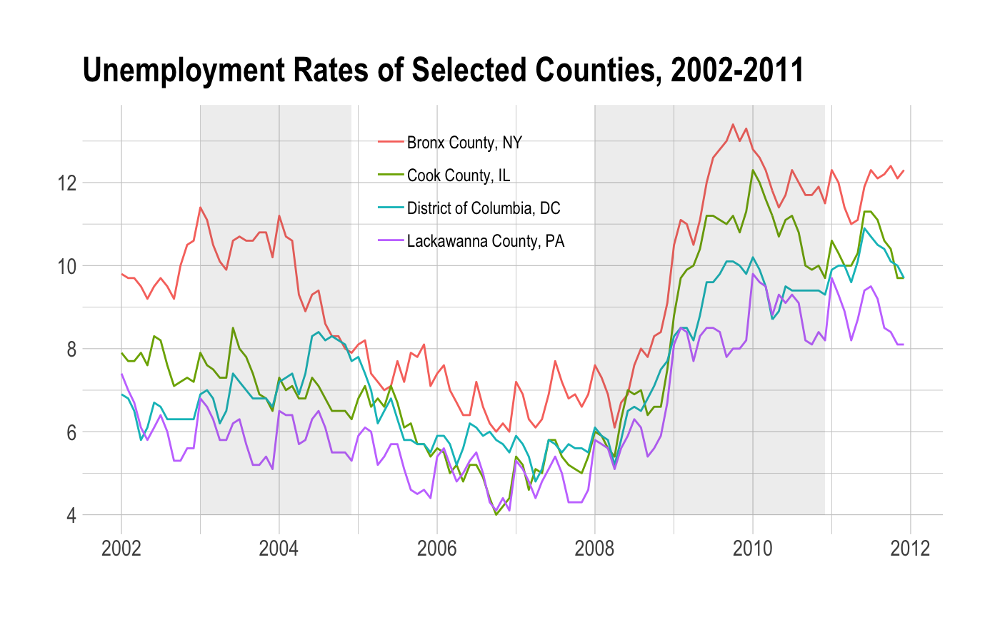
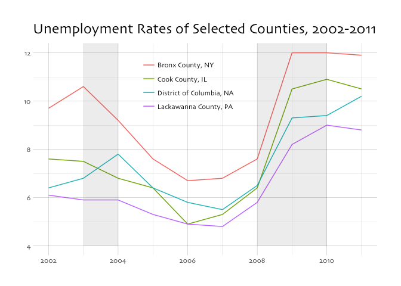

<!-- README.md is generated from README.Rmd. Please edit that file -->
[](https://travis-ci.org/jjchern/laus) [](https://ci.appveyor.com/project/jjchern/laus)

About
=====

An R data package contains Local Area Unemployment Statistics (LAUS) from U.S. Bureau of Labor Statistics (BLS). So far it contains the following four series:

-   `state_year`:
    -   State-level employment status of the civilian noninstitutional population, annual average series (1976-2016)
-   `state_month_sa`:
    -   State-level employment status of the civilian noninstitutional population, seasonaly adjusted monthly series (1976-2017.11)
-   `state_month_nsa`:
    -   State-level employment status of the civilian noninstitutional population, not seasonaly adjusted monthly series (1976-2017.11)
-   `county_year`:
    -   County-level employment status of the civilian noninstitutional population, annual average series (1990-2016)
-   `county_month_nsa`:
    -   County-level employment status of the civilian noninstitutional population, not seasonaly adjusted monthly series (1976-2017.10)

Relevant packages
-----------------

-   [`rUnemploymentData`](https://github.com/trulia/rUnemploymentData/)

Installation
============

``` r
# install.package("devtools")
devtools::install_github("jjchern/laus@v0.0.3")
```

Usage
=====

List all series
---------------

``` r
data(package = "laus")$results[,3]
#> [1] "county_month_nsa" "county_year"      "state_month_nsa" 
#> [4] "state_month_sa"   "state_year"
```

List all variable names and variable labels for `state_year`
------------------------------------------------------------

``` r
names(laus::state_year)
#>  [1] "fips"      "state"     "year"      "pop"       "clf"      
#>  [6] "pc_clf"    "emp"       "pc_emp"    "unem"      "unem_rate"

# devtools::install_github("larmarange/labelled")
labelled::var_label(laus::state_year)
#> $fips
#> [1] "FIPS code"
#> 
#> $state
#> [1] "State or area"
#> 
#> $year
#> [1] "Year"
#> 
#> $pop
#> [1] "Civilian non-institutional population"
#> 
#> $clf
#> [1] "Total numer of people in civilian labor force"
#> 
#> $pc_clf
#> [1] "Labor force participation rate (= labor force / population; Age: 16 years and over)"
#> 
#> $emp
#> [1] "Total number of people employed"
#> 
#> $pc_emp
#> [1] "Employment-population ratio (= employment / population; Age: 16 years and over)"
#> 
#> $unem
#> [1] "Total number of people unemployed"
#> 
#> $unem_rate
#> [1] "Unemployment rate (= unemployment / labor force; Age: 16 years and over)"
```

Show the data frame
-------------------

``` r
library(tidyverse)
laus::state_year
#> # A tibble: 2,120 x 10
#>     fips                state  year      pop     clf pc_clf     emp pc_emp
#>    <chr>                <chr> <chr>    <dbl>   <dbl>  <dbl>   <dbl>  <dbl>
#>  1    01              Alabama  1976  2632667 1501284   57.0 1399080   53.1
#>  2    02               Alaska  1976   239917  163570   68.2  151190   63.0
#>  3    04              Arizona  1976  1650917  987060   59.8  890988   54.0
#>  4    05             Arkansas  1976  1546583  891608   57.7  829394   53.6
#>  5    06           California  1976 15823750 9899372   62.6 8994291   56.8
#>  6   037   Los Angeles County  1976  5320083 3394724   63.8 3093718   58.2
#>  7    08             Colorado  1976  1858250 1241819   66.8 1169467   62.9
#>  8    09          Connecticut  1976  2260083 1455740   64.4 1320510   58.4
#>  9    10             Delaware  1976   420667  264791   62.9  241614   57.4
#> 10    11 District of Columbia  1976   517250  335284   64.8  305107   59.0
#> # ... with 2,110 more rows, and 2 more variables: unem <dbl>,
#> #   unem_rate <dbl>
laus::county_year
#> # A tibble: 83,650 x 11
#>          laus_code  fips state_fips county_fips          county state
#>              <chr> <chr>      <chr>       <chr>           <chr> <chr>
#>  1 CN0100100000000 01001         01         001  Autauga County    AL
#>  2 CN0100300000000 01003         01         003  Baldwin County    AL
#>  3 CN0100500000000 01005         01         005  Barbour County    AL
#>  4 CN0100700000000 01007         01         007     Bibb County    AL
#>  5 CN0100900000000 01009         01         009   Blount County    AL
#>  6 CN0101100000000 01011         01         011  Bullock County    AL
#>  7 CN0101300000000 01013         01         013   Butler County    AL
#>  8 CN0101500000000 01015         01         015  Calhoun County    AL
#>  9 CN0101700000000 01017         01         017 Chambers County    AL
#> 10 CN0101900000000 01019         01         019 Cherokee County    AL
#> # ... with 83,640 more rows, and 5 more variables: year <chr>,
#> #   labor_force <dbl>, employed <dbl>, unemployed <dbl>,
#> #   unemployment_rate <dbl>
```

Plot thematic maps with the unemployment data
---------------------------------------------





Plot selected Series
--------------------




