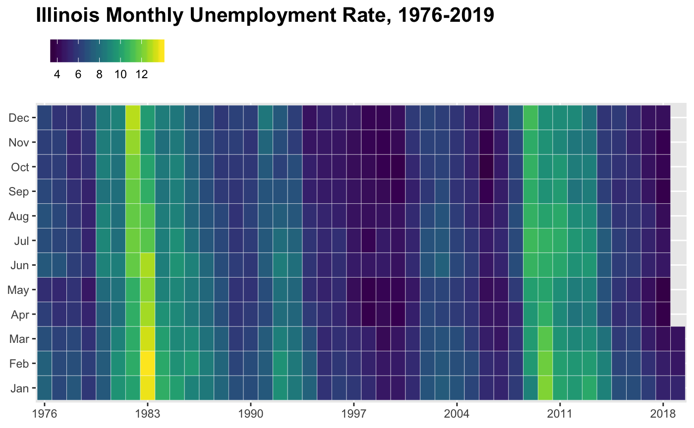

<!-- README.md is generated from README.Rmd. Please edit that file -->

[](https://travis-ci.org/jjchern/laus)
[](https://ci.appveyor.com/project/jjchern/laus)

    #> Warning: package 'knitr' was built under R version 3.4.4

# About

An R data package contains Local Area Unemployment Statistics (LAUS)
from U.S. Bureau of Labor Statistics (BLS). So far it contains the
following four series:

  - `state_year`:
      - State-level employment status of the civilian noninstitutional
        population, annual average series (1976-2018)
  - `state_month_sa`:
      - State-level employment status of the civilian noninstitutional
        population, seasonaly adjusted monthly series (1976-2019.03)
  - `state_month_nsa`:
      - State-level employment status of the civilian noninstitutional
        population, not seasonaly adjusted monthly series (1976-2019.03)
  - `county_year`:
      - County-level employment status of the civilian noninstitutional
        population, annual average series (1990-2018)
  - `county_month_nsa`:
      - County-level employment status of the civilian noninstitutional
        population, not seasonaly adjusted monthly series (1976-2019.02)

## Relevant packages

  - [`rUnemploymentData`](https://github.com/trulia/rUnemploymentData/)

# Installation

``` r
# install.package("remotes")
remotes::install_github("jjchern/laus@v0.0.4")
```

# Usage

## List all series

``` r
data(package = "laus")$results[,3]
#> [1] "county_month_nsa" "county_year"      "state_month_nsa" 
#> [4] "state_month_sa"   "state_year"
```

## List all variable names and variable labels for `state_year`

``` r
names(laus::state_year)
#>  [1] "fips"      "state"     "year"      "pop"       "clf"      
#>  [6] "pc_clf"    "emp"       "pc_emp"    "unem"      "unem_rate"

# devtools::install_github("larmarange/labelled")
labelled::var_label(laus::state_year)
#> $fips
#> [1] "FIPS code"
#> 
#> $state
#> [1] "State or area"
#> 
#> $year
#> [1] "Year"
#> 
#> $pop
#> [1] "Civilian non-institutional population"
#> 
#> $clf
#> [1] "Total number of people in civilian labor force"
#> 
#> $pc_clf
#> [1] "Labor force participation rate (= labor force / population; Age: 16 years and over)"
#> 
#> $emp
#> [1] "Total number of people employed"
#> 
#> $pc_emp
#> [1] "Employment-population ratio (= employment / population; Age: 16 years and over)"
#> 
#> $unem
#> [1] "Total number of people unemployed"
#> 
#> $unem_rate
#> [1] "Unemployment rate (= unemployment / labor force; Age: 16 years and over)"
```

## Show the data frame

``` r
library(tidyverse)
laus::state_year
#> # A tibble: 2,091 x 10
#>    fips  state   year     pop    clf pc_clf    emp pc_emp   unem unem_rate
#>    <chr> <chr>   <chr>  <dbl>  <dbl>  <dbl>  <dbl>  <dbl>  <dbl>     <dbl>
#>  1 01    Alabama 1976  2.63e6 1.50e6   57.0 1.40e6   53.1 1.02e5      6.80
#>  2 02    Alaska  1976  2.40e5 1.64e5   68.2 1.51e5   63.0 1.24e4      7.60
#>  3 04    Arizona 1976  1.65e6 9.87e5   59.8 8.91e5   54.0 9.61e4      9.70
#>  4 05    Arkans… 1976  1.55e6 8.92e5   57.7 8.29e5   53.6 6.22e4      7.00
#>  5 06    Califo… 1976  1.58e7 9.90e6   62.6 8.99e6   56.8 9.05e5      9.10
#>  6 08    Colora… 1976  1.86e6 1.24e6   66.8 1.17e6   62.9 7.24e4      5.80
#>  7 09    Connec… 1976  2.26e6 1.46e6   64.4 1.32e6   58.4 1.35e5      9.30
#>  8 10    Delawa… 1976  4.21e5 2.65e5   62.9 2.42e5   57.4 2.32e4      8.80
#>  9 11    Distri… 1976  5.17e5 3.35e5   64.8 3.05e5   59.0 3.02e4      9.00
#> 10 12    Florida 1976  6.51e6 3.60e6   55.3 3.27e6   50.3 3.30e5      9.20
#> # ... with 2,081 more rows
laus::county_year
#> # A tibble: 86,869 x 11
#>    laus_code  fips  state_fips county_fips county  state year  labor_force
#>    <chr>      <chr> <chr>      <chr>       <chr>   <chr> <chr>       <dbl>
#>  1 CN0100100… 01001 01         001         Autaug… AL    1990       16908.
#>  2 CN0100300… 01003 01         003         Baldwi… AL    1990       46824.
#>  3 CN0100500… 01005 01         005         Barbou… AL    1990       11490.
#>  4 CN0100700… 01007 01         007         Bibb C… AL    1990        7434.
#>  5 CN0100900… 01009 01         009         Blount… AL    1990       19168.
#>  6 CN0101100… 01011 01         011         Bulloc… AL    1990        4407.
#>  7 CN0101300… 01013 01         013         Butler… AL    1990        8838.
#>  8 CN0101500… 01015 01         015         Calhou… AL    1990       51519.
#>  9 CN0101700… 01017 01         017         Chambe… AL    1990       17705.
#> 10 CN0101900… 01019 01         019         Cherok… AL    1990        9644.
#> # ... with 86,859 more rows, and 3 more variables: employed <dbl>,
#> #   unemployed <dbl>, unemployment_rate <dbl>
```

## Plot thematic maps with the unemployment data

<!-- # ```{r state-map, echo=FALSE} -->

<!-- # # Combine state map data with unemployment rate -->

<!-- # # devtools::install_github("jjchern/usmapdata") -->

<!-- # usmapdata::state %>%  -->

<!-- #   inner_join(laus::state_year, by = c("id" = "fips")) -> unem -->

<!-- #  -->

<!-- # # Plot a Map -->

<!-- #  -->

<!-- # library(gganimate) -->

<!-- #  -->

<!-- # ggplot() + -->

<!-- #   geom_map(data = unem, map = unem, -->

<!-- #            aes(x = long, y = lat, map_id = id, fill = unem_rate, frame = year), -->

<!-- #            colour = alpha("white", 0.5), size=0.2) + -->

<!-- #   coord_map("albers", lat0 = 30, lat1 = 40) + -->

<!-- #   viridis::scale_fill_viridis(option = "B") + -->

<!-- #   ggtitle("US Unemplyment Rates (%) by State in") + -->

<!-- #   ggthemes::theme_map() + -->

<!-- #   theme(legend.position = c(.85, .3), -->

<!-- #         legend.title=element_blank(),  -->

<!-- #         plot.title = element_text(hjust = 0.5)) -> g -->

<!-- #  -->

<!-- # gganimate(g) -->

<!-- # ``` -->


<!-- # ```{r county-map, echo=FALSE} -->

<!-- # usmapdata::county %>%  -->

<!-- #         inner_join(laus::county_year, by = c("id" = "fips")) -> unem_county -->

<!-- #  -->

<!-- # ggplot() + -->

<!-- #   geom_map(data = unem_county, map = unem_county, -->

<!-- #            aes(x = long, y = lat, map_id = id, fill = unemployment_rate, frame = year), -->

<!-- #            colour = alpha("white", 0.1), size=0.2) + -->

<!-- #   geom_map(data = usmapdata::state, map = usmapdata::state, -->

<!-- #            aes(x = long, y = lat, map_id = id), -->

<!-- #            colour = alpha("white", 0.75), fill = "NA") +         -->

<!-- #   coord_map("albers", lat0 = 30, lat1 = 40) + -->

<!-- #   viridis::scale_fill_viridis(option = "B") + -->

<!-- #   ggtitle("US Unemplyment Rates (%) by County in") + -->

<!-- #   ggthemes::theme_map() + -->

<!-- #   theme(legend.position = c(.85, .3), -->

<!-- #         legend.title=element_blank(),  -->

<!-- #         plot.title = element_text(hjust = 0.5)) -> c -->

<!-- #  -->

<!-- # gganimate(c) -->

<!-- # ``` -->


## Plot selected Series

<!-- -->

<!-- -->

<!-- -->
