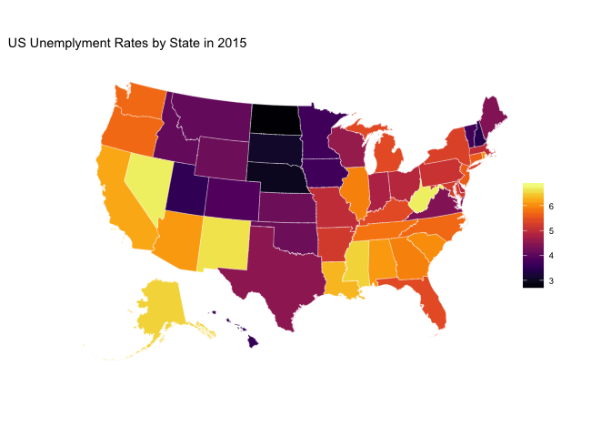

<!-- README.md is generated from README.Rmd. Please edit that file -->
[](https://travis-ci.org/jjchern/laus)

About
=====

An R data package contains Local Area Unemployment Statistics (LAUS) from U.S. Bureau of Labor Statistics (BLS). So far it contains the following three series:

-   Employment status of the civilian noninstitutional population, annual average series (1976-2015)
-   Employment status of the civilian noninstitutional population, seasonaly adjusted monthly series (1976-2015)
-   Employment status of the civilian noninstitutional population, not seasonaly adjusted monthly series (1976-2015)

Installation
============

``` r
# install.package("devtools")
devtools::install_github("jjchern/laus")
```

Usage
=====

List all series
---------------

``` r
data(package = "laus")$results[,3]
#> [1] "state_month_nsa" "state_month_sa"  "state_year"
```

List all variable names and variable labels for `state_year`
------------------------------------------------------------

``` r
names(laus::state_year)
#>  [1] "fips"      "state"     "year"      "pop"       "clf"      
#>  [6] "pc_clf"    "emp"       "pc_emp"    "unem"      "unem_rate"

# devtools::install_github("larmarange/labelled")
labelled::var_label(laus::state_year)
#> $fips
#> [1] "FIPS code"
#> 
#> $state
#> [1] "State or area"
#> 
#> $year
#> [1] "Year"
#> 
#> $pop
#> [1] "Civilian non-institutional population"
#> 
#> $clf
#> [1] "Total numer of people in civilian labor force"
#> 
#> $pc_clf
#> [1] "Labor force participation rate (= labor force / population; Age: 16 years and over)"
#> 
#> $emp
#> [1] "The number of people employed"
#> 
#> $pc_emp
#> [1] "Employment-population ratio (= employment / population; Age: 16 years and over)"
#> 
#> $unem
#> [1] "The number of people unemployed"
#> 
#> $unem_rate
#> [1] "Unemployment rate (= unemployment / labor force; Age: 16 years and over)"
```

Show the data frame
-------------------

``` r
library(dplyr, warn.conflicts = FALSE)
laus::state_year
#> Source: local data frame [2,120 x 10]
#> 
#>     fips                state  year      pop     clf pc_clf     emp pc_emp
#>    (chr)                (chr) (chr)    (dbl)   (dbl)  (dbl)   (dbl)  (dbl)
#> 1     01              Alabama  1976  2632667 1501284   57.0 1399080   53.1
#> 2     02               Alaska  1976   239917  163570   68.2  151190   63.0
#> 3     04              Arizona  1976  1650917  987060   59.8  890988   54.0
#> 4     05             Arkansas  1976  1546583  891608   57.7  829394   53.6
#> 5     06           California  1976 15823750 9899372   62.6 8994291   56.8
#> 6    037   Los Angeles County  1976  5320083 3394724   63.8 3093718   58.2
#> 7     08             Colorado  1976  1858250 1241819   66.8 1169467   62.9
#> 8     09          Connecticut  1976  2260083 1455740   64.4 1320510   58.4
#> 9     10             Delaware  1976   420667  264791   62.9  241614   57.4
#> 10    11 District of Columbia  1976   517250  335284   64.8  305107   59.0
#> ..   ...                  ...   ...      ...     ...    ...     ...    ...
#> Variables not shown: unem (dbl), unem_rate (dbl)
```

Export the data set as a Stata `dta` file
-----------------------------------------

``` r
# install.package("haven")
haven::write_dta(laus::state_year, "dta/state_year.dta")
```

Plot a thematic map with the unemployment data
----------------------------------------------

``` r
# 2015 US unemployment rate
laus::state_year %>% 
  filter(year == 2015) %>% 
  select(fips, state, unem_rate) -> unem_2015
summary(unem_2015$unem_rate)
#>    Min. 1st Qu.  Median    Mean 3rd Qu.    Max. 
#>   2.700   4.200   5.200   5.085   5.900   6.900

# Combine state map data with unemployment rate
# devtools::install_github("jjchern/usmapdata")
usmapdata::state %>% 
  inner_join(unem_2015, by = c("id" = "fips")) -> unem_2015

# Plot a Map

library(ggplot2)
library(viridis)

ggplot() +
  geom_map(data = unem_2015, map = unem_2015,
           aes(x = long, y = lat, map_id = id, fill = unem_rate),
           colour = alpha("white", 0.5), size=0.2) +
  coord_map("albers", lat0 = 30, lat1 = 40) +
  scale_fill_viridis(option = "B") +
  ggtitle("US Unemplyment Rates by State in 2015") +
  ggthemes::theme_map() +
  theme(legend.position = c(.85, .3),
        legend.title=element_blank())
```


